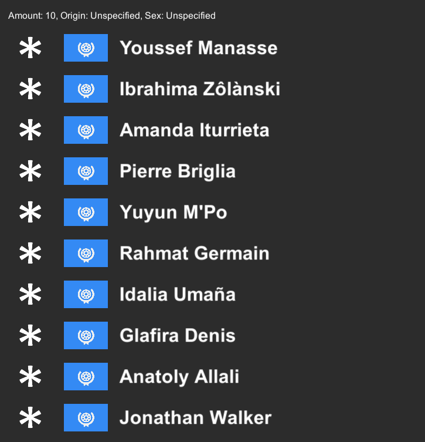

# Procedural Text Generator
This unity project contains different approaches and datasets to procedurally generate words of a certain type. All implementations are custom-made without the use of external libraries.

The project contains 2 main generators:
- A Classic Generator, which allows you to generate words of a certain type (planets, countries, provinces, minerals, etc.) with either Markov Chains or CNN's.
- A Geographical Generator, which will generate people (their first name, last name, sex and home town) based on their origin and sex. 

# How to Use
To use the generators, simply run **Builds/ProceduralTextGeneration.exe** and chose the desired generators, attributes and filters. Use the big, green "Generate" buttons to generate outputs. Enjoy :)

# Examples
*15 Province names generated with Markov Chains (n-gram length: 4)*
  

*15 Country names generated with a CNN (training iterations: > 1'000'000, skew factor: 0.8)*
  

*10 people generated with the Geographical Generator (origin: mixed, sex: mixed)*
  

*10 people generated with the Geographical Generator (origin: unspecified, sex: unspecified)*
  

