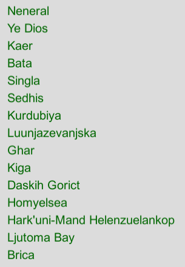
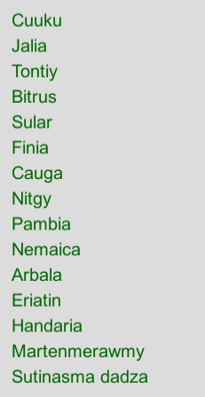
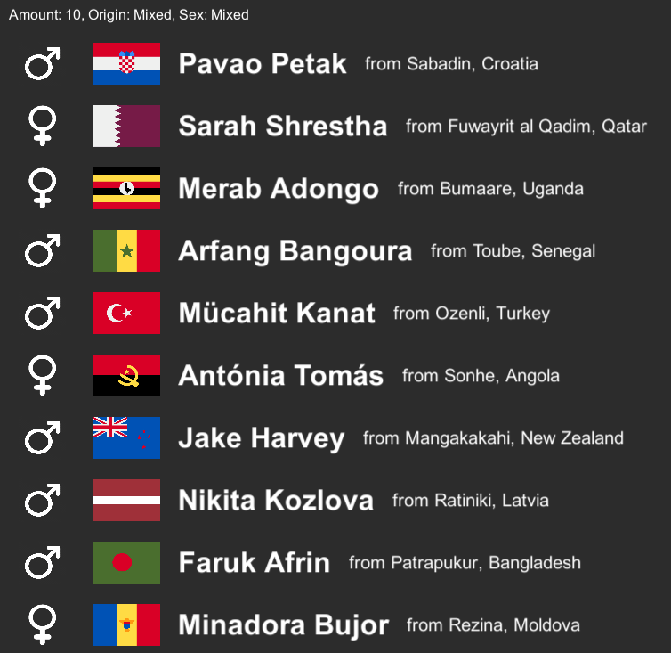

# Procedural Text Generator
This unity project contains different approaches and datasets to procedurally generate words of a certain type. All implementations are custom-made without the use of external libraries.

Currently there are 3 different generation methods: Markov Chains, Convolutional Neural Networks (CNN) and a "Person Generator"

# How to Use
To use the generators, simply run **Builds/ProceduralTextGeneration.exe** and chose the desired generators, attributes and filters. Use the big, green "Generate" buttons to generate outputs. Enjoy :)

# Examples
*Province names generated with Markov Chains (n-gram length: 4)*
  

*15 Country names generated with a CNN (training iterations: > 1'000'000, skew factor: 0.8)*
  

*15 people generated with the Person Generator (origin: mixed, sex: mixed)*
  

